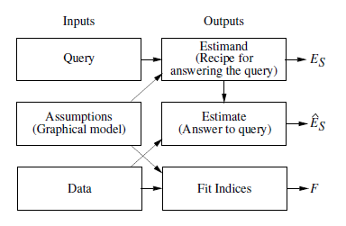

# Seven Tools of Causal Inference with Reflections on Machine Learning

## The Three Layer Causal Hierarchy

The three levels of causal information:

- Association
  - $P(y|x)$
  - How would seeing $X$ change my belief in $Y$?
- Intervention
  - $P(y|do(x), z)$
  - How would changing $X$ change $Y$?
- Counterfactual
  - $P(y_x|x', y')$
  - What would $Y$ be if $X = x$ given $X = x'$ and $Y = y'$?

## Structural Causal Models (SCMs)

- Graphical Models
  - what we know about the world
- Structural Equations
- Counterfactual and Interventional Logic
  - what we want to know

Fig. 2. SCM "inference engine"

In the example (pp. 3), with X -> Y and a simple confounder Z there isn't enough evidence to refute or support the causal model given the assumptions.

## Tools of Causal Inference

**Tool 1** - Encoding causal assumptions with transperancy and testibility

- causal diagrams (tranperancy)
- d-separation (testibility)

**Tool 2** - Do-calculus and control of confounding

- Backdoor criterion

**Tool 3** - Algorithmification of counterfactuals

- Every SCM determines the truth value of every counterfactual sentence.

**Tool 4** - Mediation analysis and assessment of direct and indirect effects

- Counterfactual analysis must be involved for indentification.

**Tool 5** - Adaptability, external validity, and sample selection bias

- Changes in association do not uniquely identify underlying causal mechanisms.

This problem requires a causal model...

> "...the reason being that surface changes in observed associations do not uniquely identify the underlying mechanism responsible for the change."

**Tool 6** - Recovering missing data

- Formalize the conditions under which causal and probalistic relationships can be recovered.

> "The rich literature on this problem is wedded to a model-free paradigm of associational analysis and, accordingly, it is severely limiited to situations where missingness occurs at random."

**Tool 7** - Causal Discovery

- d-separation: testable implications of causal model natural experiments.
- Infer direction of arrows by determining which variables should be "more Gaussian."
- Natural experiments - sudden changes in X

## Conclusions

The models used here are structural (there is no committment to a particular form of distributions)

All inferences depend critically on the veracity of the assumed structure.
